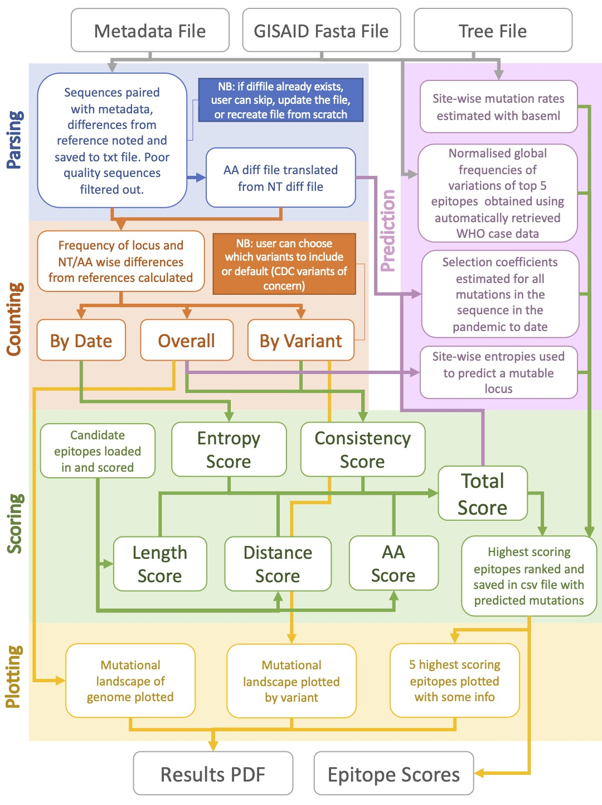

# EvoCov
This is EvoCov, a pipeline designed for analysis of SARS-CoV-2 sequences from GISAID. The pipeline can be run interactively or by default, with a view to using SARS-CoV-2 sequence information to make an evolutionarily aware estimate of efficient epitopes on the spike protein for antibody design.

## Installation
Clone the github repository to your machine to use the EvoCov package. Before using, you should check that any python dependencies are installed.

```bash
git clone https://github.com/ciarajudge/EvoCov.git
```

```bash
pip install -r requirements.txt
```


## Default Usage
Navigate to the cloned repository and call the package along with the file paths of your latest GISAID masked sequence file and metadata file. This will initiate a default run of the pipeline, including handling of any exceptions or options. This includes the final step of the pipeline where the results are piped to a PDF using R.

```bash
python -m evocov /path/to/sequencefile_masked.fa /path/to/metadata.tsv
```

## Interactive Usage
Navigate to the cloned repository and call the package using the below command.

```bash
python -m evocov
```

Running the pipeline in this manner will create an interactive session where you will be able to select file names for the output, and give the names of the variants you want included in the analysis. Following epitope scoring you will also be given the option to use R to generate an output PDF with the key findings of the pipeline.

## Pipeline Structure
Below is a flowchart outlining the rough pipeline structure.


## Things to note
1. The 'consistency scores' in the output are works in progress, and for now will be assigned 0 until this aspect has been completed and debugged (ETA Wed 23/6/21)
2. The pipeline downloads WHO case data for normalisation by country, but currently does not carry this out just yet. The best way to normalise by country given varied sequencing levels etc is still up for debate, so if you have any suggestions for this feel free to email ciarajudge@ebi.ac.uk.

## Contributing
Pull requests are welcome. For major changes, please open an issue first to discuss what you would like to change.

## License
[MIT](https://choosealicense.com/licenses/mit/)

